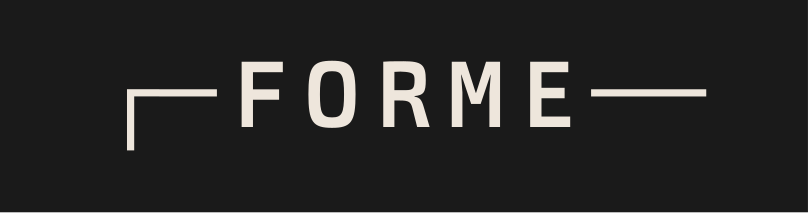

# forme

Declarative terminal UI for Go.


```go
VBox.Border(BorderDouble).BorderFG(Green).Title("SYS").FitContent().CascadeStyle(&green)(
    If(&online).
        Then(Text("● ONLINE")).
        Else(Text("● OFFLINE").FG(Red)),
    HRule(),
    Leader("CPU", &cpu),
    Leader("MEM", &mem),
    Sparkline(&history),
)
```

## Install

```bash
go get github.com/kungfusheep/forme
```

## Quick Start

```go
package main

import . "github.com/kungfusheep/forme"

func main() {
    app, _ := NewApp()
    app.SetView(Text("Hello, terminal!")).Run()
}
```

---

## Dynamic Content

Pass a pointer to read the current value on each render:

```go
name := "world"
Text(&name)  // reads *name each frame
```

## Layout

```go
VBox(                          // vertical stack
    Text("Header"),
    HBox(                      // horizontal stack
        Text("Left"),
        Space(),               // flexible spacer
        Text("Right"),
    ),
    Text("Footer"),
)

VBox.Gap(2)(...)               // spacing between children
VBox.Border(BorderRounded)(...)// bordered container
HBox.Width(41)(...)            // fixed width
```

## Styling

```go
Text("hello").Bold().FG(Red).BG(Black)

// Colors: Red, Green, Blue, Cyan, Magenta, Yellow, White, Black
//         BrightRed, BrightGreen, ...
//         PaletteColor(202)     // 256 palette
//         RGB(256, 128, 64)     // true color
//         Hex(0xFF8041)
```

### CascadeStyle

Apply a style that cascades down to all children:

```go
green := Style{FG: Green}

VBox.CascadeStyle(&green)(
    Text("I'm green"),
    Text("Me too"),
    Text("Override").FG(Red),  // still works
)
```

## Iteration

```go
items := []Item{{Name: "Apple"}, {Name: "Banana"}}

ForEach(&items, func(item *Item) any {
    return Text(&item.Name)
})
```

## Conditionals

```go
If(&selected).Then(
    Text("> active"),
).Else(
    Text("  inactive"),
)
```

## AutoTable

Struct slice to table:

```go
people := []Person{{"Alice", 30}, {"Bob", 25}}

AutoTable(people)                    // all fields auto-detected
AutoTable(people).Columns("Name")    // select columns
```

## Custom Widgets

```go
Widget(
    func(availW int16) (w, h int16) { return availW, 1 },
    func(buf *Buffer, x, y, w, h int16) {
        // direct buffer access for custom rendering
    },
)
```

## Input

```go
app.Handle("q", app.Stop)
app.Handle("<C-c>", app.Stop)           // ctrl+c
app.Handle("<enter>", func() { submit() })
```

## Components

| Component | Description |
|-----------|-------------|
| `Text(s)` | Text (string or *string) |
| `VBox` / `HBox` | Vertical / horizontal layout |
| `Space()` | Flexible spacer |
| `HRule()` | Horizontal line |
| `Leader` | Label with dot leader |
| `Progress` | Progress bar |
| `Sparkline` | Mini line chart |
| `ForEach` | Slice iteration |
| `If().Then().Else()` | Conditional |
| `AutoTable` | Struct slice to table |
| `List` / `CheckList` | Navigable lists |
| `Widget` | Custom render function |

## Full Example

A simple todo app:

```go
package main

import . "github.com/kungfusheep/forme"

type Todo struct {
    Text string `forme:"render"`
    Done bool   `forme:"checked"`
}

func main() {
    todos := []Todo{{"Learn forme", true}, {"Build something", false}}
    var input Field

    app, _ := NewApp()
    app.SetView(
        VBox.Border(BorderRounded).Title("Todo").FitContent().Gap(1)(
            CheckList(&todos).
                BindNav(app, "<C-n>", "<C-p>").
                BindToggle(app, "<tab>").
                BindDelete(app, "<C-d>"),
            HBox.Gap(1)(
                Text("Add:"),
                TextInput{Field: &input, Width: 30},
            ),
        )).
        Handle("<enter>", func() {
            if input.Value != "" {
                todos = append(todos, Todo{Text: input.Value})
                input.Clear()
            }
        }).
        Handle("<C-c>", app.Stop).
        BindField(&input).
        Run()
}
```

## Demos

| Demo | Description |
|------|-------------|
| `go run ./cmd/hero` | The hero screenshot above |
| `go run ./cmd/todo` | Todo app with checklist |
| `go run ./cmd/happypath` | Basic layout patterns |
| `go run ./cmd/tabledemo` | AutoTable showcase |
| `go run ./cmd/widgetdemo` | Custom widget examples |
| `go run ./cmd/jumpdemo` | Vim-style jump labels |
| `go run ./cmd/minivim` | Full text editor |

## License

Apache-2.0 License. See [LICENSE](./LICENSE) for details.
